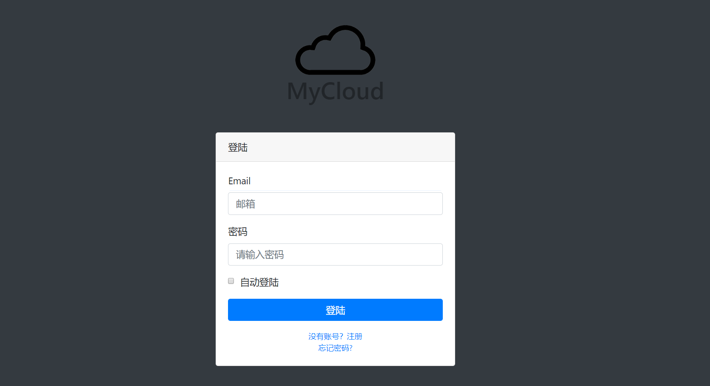

# MyCloud
 > NEU JSP课设

## 关于
看到NextCloud就一直想做一个自己的网盘，也算是对之前写的单用户的[Share](http://share.xuranus.com)的一种升级。最近在学Node，正好赶上JSP课，就突发奇想能不能把两个结合起来，搞个“前后端分离”。  

项目用了两个服务器，一个Tomcat，一个Node。Tomcat上的JSP验证登陆状态实现跳转和部分的静态的后端渲染（头像，昵称）。Node则做API，和前端ajax用json通信。登陆采用二次登陆，跨域请求Node的Session，成功后再请求Tomcat的Jession。

## 功能
简答的增删改查，文件的上传修改删除，文件夹创建，回收站，文件归类，文件预览...  
并没什么卵用社交：生成分享链接，发动态，聊天，加好友，通知推送。   
支持密码邮件找回，邮件部分使用了Java mail调用QQ邮箱smtp服务。

## 部署
1. 数据库配置：数据库的建表在SQLBuilder.js里  
2. Tomcat后端配置：修改`Config.java`里的配置,包括jdbc用户名密码，文件服务器地址  
3. 文件服务器配置：存储文件的地方  
4. 前端WebContent配置：修改`WebContent/Js`中`Config.js`的配置，包括Tomcat，Node，文件服务器的公网地址  
5. Node配置,修改`MySQLConnectionConfig.js`的数据库配置,修改文件路由`fileRouter.js`的文件存储路径  

讲道理...写的太辣鸡了，太难部署了，各位就看看图吧      

  

  

  

  

  

  
