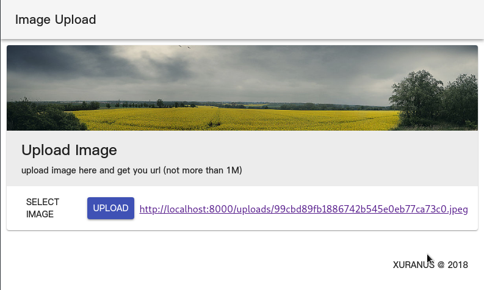

# ImageUpload
upload image and fetch url,build by npm
 - web front: react-material-ui

## Install 
```
npm install
npm run build
nohup node start.js &
```

## config
edit `start.js` to modify app running port, all uploads will be store in `uploads/` by default


