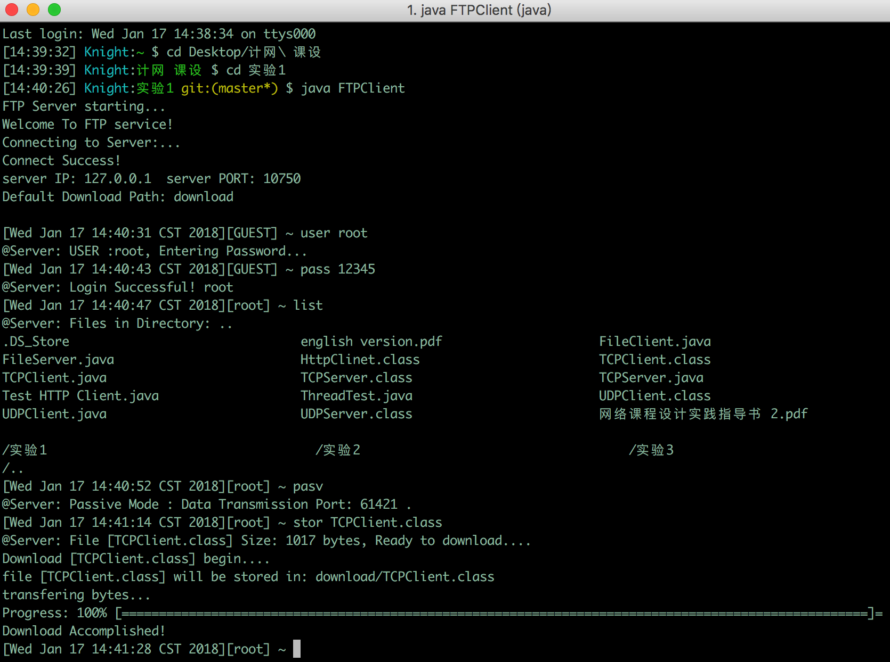

# SimpleFTP
use java socket to write a FTP server and client

# Install  
edit `*.config` files, then compile and run  
`javac FTPServer.java`  
`java FTPServer`  
`javac FTPClient.java`  
`java FTPClient`  

# Features
 - ProgressBar  
 - MutiThread & MutiUsers  
 - Zsh like Interface  

# Usage 
Commands: `USER`, `PASS`, `PASV`, `SIZE`, `LIST`, `CWD`, `STOR`, `RETR`  

 
