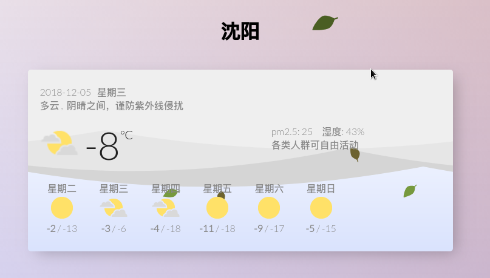

# Weather Widget

## 简介
一个静态的网页小部件，提供选择城市，天气查询，天气预报的功能（无数据库）

在线体验的链接：[http://www.hellogalaxy.cn/weather/](http://www.hellogalaxy.cn/weather/)

## 实现
在一个免费的天气api服务：[天气JSON](https://www.sojson.com/blog/305.html)的基础上实现，自己实现了表示层，对已有的服务复用。

接口说明：

| 接口地址 | 类型 | 提交数据类型 | 返回数据类型 |
| ------ | ------ | ------ | ------ |
| http://t.weather.sojson.com/api/weather/city/{city_code} | GET | city_code（城市代码） | json（详见官网API描述） |

## 部署
静态页面项目，无需配置，但是需要用到cookie，不能以文件形式直接打开。  
需要一个静态文件(nginx/apache2)即可，`cd`进入web服务器的Doc目录，直接`clone`即可完成部署
```
git clone https://github.com/XUranus/weather_widget.git
```

或者用python一行实现：
```
git clone https://github.com/XUranus/weather_widget.git
cd weather_widget
python -m http.server 8080
```
浏览器打开即可访问。

## 使用
初次使用需要输入城市名，例如`沈阳`，`北京`，`南通`(不能输入省)，成功后cookie会记录城市代码，要改变城市可以点击城市名修改。

